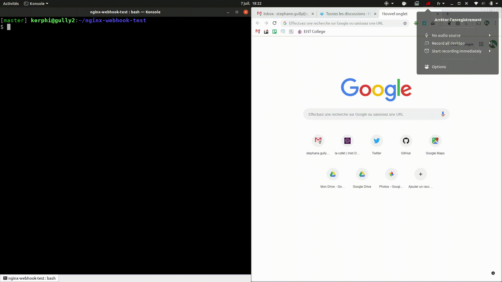

# nginx-webhook-test
Un test de nginx pour voir comment le configurer pour lui faire exécuter un script shell lors de l'appel d'une URL (usecase: webhook)

Exemple de cas d'usage: github/gitlab pourrait appeler le webhook du nginx qui héberge un site web static qui se chargerait alors de déclencher un git pull pour pouvoir mettre à jour un site web static dont le code source est lui même hébergé et géré sur gitlab/github.




## Usage

```
docker-compose up
```

Then 

```
curl http://127.0.0.1:8081/webhook
```


